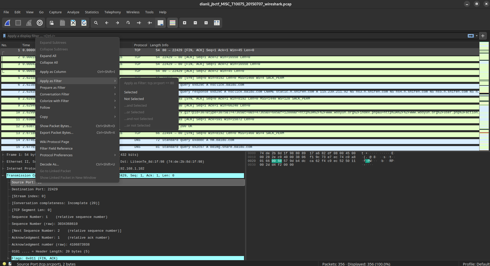

# File
## 1. File type identification

### 1.1 file
a command in linux to show file type

### 1.2 winhex 
a commnd in windows to show file type through file header messgae

### 1.3 incompelete or wrong file header 
```bash
# file example.png
example.png: data
```

---
Some useful file header
  1 JPEG (jpg)，file header：FFD8FF
  2 PNG (png)，file header：89504E47
  3 GIF (gif)，file header：47494638
  4 TIFF (tif)，file header：49492A00
  5 Windows Bitmap (bmp)，file header：424D
  6 CAD (dwg)，file header：41433130
  7 Adobe Photoshop (psd)，file header：38425053
  8 Rich Text Format (rtf)，file header：7B5C727466
  9 XML (xml)，file header：3C3F786D6C
 10 HTML (html)，file header：68746D6C3E
 11 Email [thorough only] (eml)，file header：44656C69766572792D646174653A
 12 Outlook Express (dbx)，file header：CFAD12FEC5FD746F
 13 Outlook (pst)，file header：2142444E
 14 MS Word/Excel (xls.or.doc)，file header：D0CF11E0
 15 MS Access (mdb)，file header：5374616E64617264204A
 16 WordPerfect (wpd)，file header：FF575043
 17 Postscript (eps.or.ps)，file header：252150532D41646F6265
 18 Adobe Acrobat (pdf)，file header：255044462D312E
 19 Quicken (qdf)，file header：AC9EBD8F
 20 Windows Password (pwl)，file header：E3828596
 21 ZIP Archive (zip)，file header：504B0304
 22 RAR Archive (rar)，file header：52617221
 23 Wave (wav)，file header：57415645
 24 AVI (avi)，file header：41564920
 25 Real Audio (ram)，file header：2E7261FD
 26 Real Media (rm)，file header：2E524D46
 27 MPEG (mpg)，file header：000001BA
 28 MPEG (mpg)，file header：000001B3
 29 Quicktime (mov)，file header：6D6F6F76
 30 Windows Media (asf)，file header：3026B2758E66CF11
 31 MIDI (mid)，file header：4D546864


## 2. File separation

### 2.1* binwalk
analyse file: show hidden files that may exist
> binwalk filename

extract file
> binewalk -e filename

### 2.2* foremost
Use if binwalk not take effect

a powerful tool similar to binwalk
> foremost filename -o output-dir

### 2.3 dd

the hardest one, could manual separation files
> dd if=source-file of=tar-file bs=block-size count=blocks-number skip=numbers-to-skip

1. if:   input filename
2. of:   output filename
3. bs:   set the read and write block size
4. count:    set the block numbers
5. skip: skip the first $numbers blocks

always usage: binwalk analyse + dd manual separation

### 2.4 winhex
in windows
not recommand, usually use **010 editor** in windows

### 2.5 010 Editor
> give you a txt file full of hex code, import it to 010editor and then save as a rar(or others, it's depends on the file header)

### 2.6** hexedit
in linux you can use hexedit, it's powerful and free

### 2.7 ghex
You can insert data to the file


## 3. File merge

### 3.1 linux
> cat file1 file2...filen > tarfile

> cat file* > tarfile

**after the file is merged, the file header may alse need to be added**
That is, although you have merged the file to target, for example a jpg, the picture still can't see. And $file example.jpg$ shows you it's a data, then you need to add the file header manully.

integrity check:    md5sum filename

### 3.2 windows
> copy /B file1+file2+file3 tarfile

integrity check:    certutil -hashfile filename md5


# Picture
## 1. Picture file hidden write(stego)

### 1.1 Firework

### 1.2* Exiftool

In linux, you can use **exiftool** to search for the exif information where can hide important data.
For example, in arch you can use **yay -S perl-image-exiftool** to download it.

### 1.3* stegsolve
Powerful!!!
It can analyse the CRC value, as well as width and height, see [dabai](Wp/misc.md)
Just use file formate option in Analyse list.

当两张jpg图片外观、大小、像素都基本相同时，可以考虑进行结合分析，即将两个文件的像素RGB值进行XOR、ADD、SUB等操作，看能否得到有用的信息，stegsolve可以方便的进行这些操作.

Scenes to be used: two pictures near same

### 1.4* LSB(Least Significant Bit)

将嵌入信息取代载体图片的最低位比特，RGB中每一种原色占八位.通过修改像素中最低位的1bit来达到隐藏的效果.

Tool: stegsolve, zsteg, wbstego4, python

recommand: zsteg
list all the possible text
> zsteg filename

wbstego4: most used for bmp file

### 1.5* tweakPNG

用于修改png图像文件的元信息
文件头正常却无法打开文件，可利用tweakpng修改CRC
用tweakpng查看CRC的错误以及正确值，然后用hexedit进行更改
有时CRC没有错误，但图片的高度和宽度发生了错误，需要根据CRC计算出图片正确的高度和宽度，用python脚本计算

In linux you may need to use wine to operate the tweakpng like this
> wine path/tweakpng.exe xxx.png

Or you can just use stegsolve.

### 1.6* Steghide

Find the hidden information in the stego file.
> steghide extract -sf stegfile

### 1.7 bftools
decrypt the encrypted picture in windows
> Bftools.exe decode braincopter sourcefile --output outfile
>
> Bftools.exe run outfile

### 1.8 slienteye
decrypt the encrypted picture in windows

### 1.9 stegdetect
Most used for jpeg
Analyse the way that jpg encrypted(JSteg, JPHide,OutGuess,F5,appendX...)
> stegdetect xxx.jpg

Once you get the encryption, you can decrypt the jpg with corresponding methods.(Google by yourself)

### 1.10 QRcode
Some questions reverse the black and white of the picture 

## 2. Wav Stego

### 2.1 audacity
Powerful audio processing software


# Zip file

## 1. pseudo encryption
zip文件通过一位标识符来显示是否加密，在每个文件的文件目录字段有一位专门标识了文件是否加密，设置为0表示未加密.设置为0后能解压则为伪加密，否则为真加密.

找到**504b0102**，再往后数九到10位(包括504b)，将其置为0000

rar文件 从第一位往后数到第24位，将尾数改为0即可破解伪加密.

## 2. brute force(暴力破解)

### 2.1 archpr.exe(windows)

### 2.2* unzip, unrar, tar

### 2.3 fcrackzip
Powerful zip file encryption.

### 2.4 Rarcrack
It's a multi-threads encryption tool, and it supports zip,rar,7z.
> rarcrack filename [--threads NUM] [--type rar|zip|7z]

You can speed up by modifying the .xml file in the same directory.

### 2.5 Brainfuck and ook!


### 2.* Hashcat

# Forensic

## 1.** Wireshark

### 1.1 Filter
1. ip 
ip.src eq x.x.x.x or|and ip.dst eq x.x.x.x or|and ip.addr eq x.x.x.x

2. port
tcp.port eq 80 or udp.port eq 80
tcp.dstport == 80
tcp.srcport == 80
tcp.port >= 1 and tcp.port <= 80

3. protocal
tcp/udp/arp/icmp/http/ftp/dns/ip

4. mac

5. packet length
udp.length == 26
tcp.len >= 7
ip.len == 94
frame.len == 119

6. **http**
http.request.method == "GET"
http.request.method == "POST"
http.request.uri == "/img/xxx.gif"
http contains "GET"
http contains "HTTP/1."
http contains "flag"
http contains "key"
tcp contains "flag"
You can use '||' or '&&' to combine

The most easy one, flag just hide in the packet, we can filt with **contains**

### 1.2 Protocol Hierarchy(协议分级) 
查看主要流量是在哪个包中
Statistics -> Protocol hierarchy

### 1.3 Protocol Analyse


### 1.4 Stream aggregation(流汇聚)
Key point in http streams
1. HTML中直接包含重要信息
2. 上传或下载文件内容,通常包含文件名,hash值等关键信息,常用POST请求上传
3. 一句话木马,POST请求,内容包含eval,内容使用base64加密

### 1.5 Data extraction
1. auto extract http content
> file -> export objects -> http

2. manual extract
> 右键 -> export packet bytes

## 2. Wireless packet

### 2.1 aircrack-ng
Used to crack wifi password.

aircrack-ng xxx.cap -w pass.txt

### 2.2 USB flow

一般涉及键盘击键,鼠标移动与点击,存储设备的明文传输通信,USB无线网卡网络传输内容

#### 键盘击键: apply as column at first

Manual
1. file -> export packet dissections -> .csv
2. tshark

Auto
Use [**UsbMiceDataHacker**](https://github.com/WangYihang/UsbMiceDataHacker)
> python UsbMiceDataHacker.py example.pcap out.png

#### 鼠标流量:

Manual
> tshark -r example.pcap -T fields -e usb.capdata > data

Then use **gnuplot** to show the picture.

Auto
Use [**UsbKeyboardDataHacker**](https://github.com/WangYihang/UsbKeyboardDataHacker)
> python UsbKeyDataHacker.py example.pcap

## 3. HTTPS traffic packet analyse

HTTPS流量经过TLS协议加密过,需要导入key才能看到原始的HTTP流量

> Edit -> Preferences -> Protocols -> RSA keys

