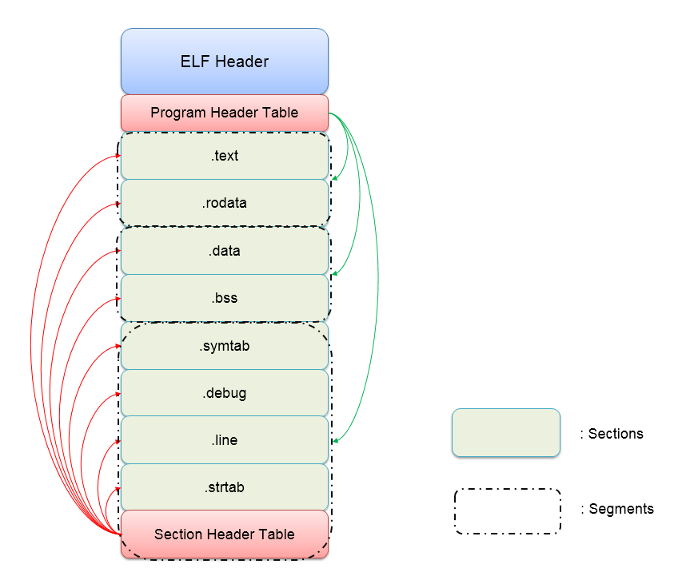

# Tools

## 1. IDA

Static analyse

## 2. pwntools

Python lib. Download the pwntools.
```zsh
pip install pwn
```
If you download the pwntools, you will also get 3. and 4.

## 3. checksec

## 4. ROPgadget

## 5. gdb(pwndbg)

Dynamic debug

## 6. one_gadget

## 7. main_arane_offset

# Binary Basic

## c_source_code to elf file

1. C code(p1.c p2.c) --(compiler: gcc -S)> Assembly(p1.s p2.s)
> note that we omit the include step

2. Assebly(p1.s p2.s) --(compiler: gcc -c)> Object(p1.o p2.o)
3. Object(p1.o p2.o) --(linker: gcc)> Executable(p)

## executable file

windows:PE
    1. .exe
    2. .dll(dynamic link library)
    3. .lib(static link library)

linux:**ELF**
    1. .out
    2. .so(dynamic link library)
    3. .a(static link library)

## ELF file structure

.elf => {header1/2, sections, header2/2}

header1/2 => {ELF header, Program header table}

> ELF header: the whole frame(structure) of the elf file

> Program header table: segment information

section => {Code, Data, Sections' names}

> Code: code segment

> Data: data segment

> Sections' names:  name of the section

header2/2 => {Section Header table}

> Section Header table: section information 


More on [this](https://luomuxiaoxiao.com/?p=139)

## Program Load and Run

Linking View: on disk to show different function

Execution View: on memory to show different read-write Permission


### 1. objdump
display information of object file, such as a.out
```
objdump -s elf
```

### 2. cat /proc/pid/maps
objdump display the disk view, while this diaplay the memory view


