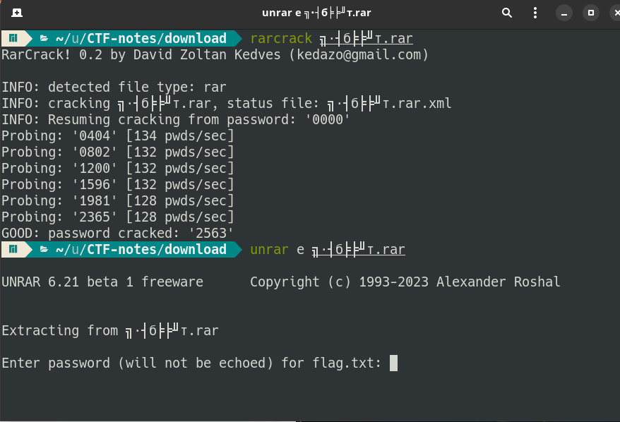
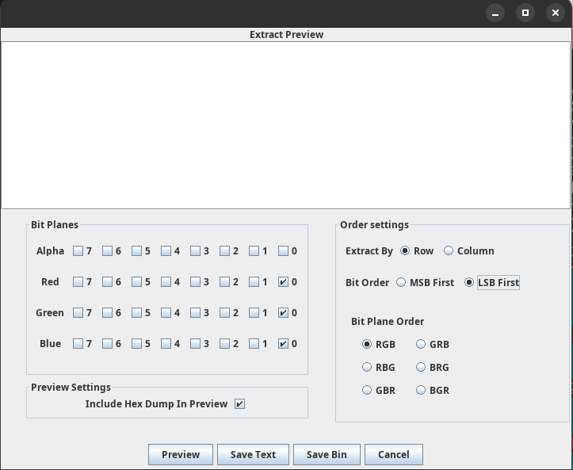
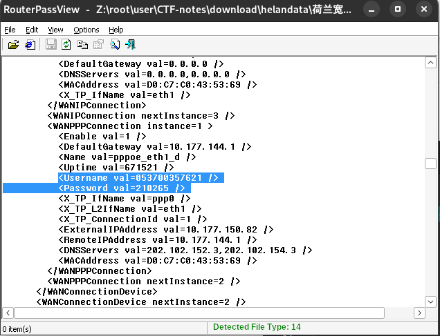
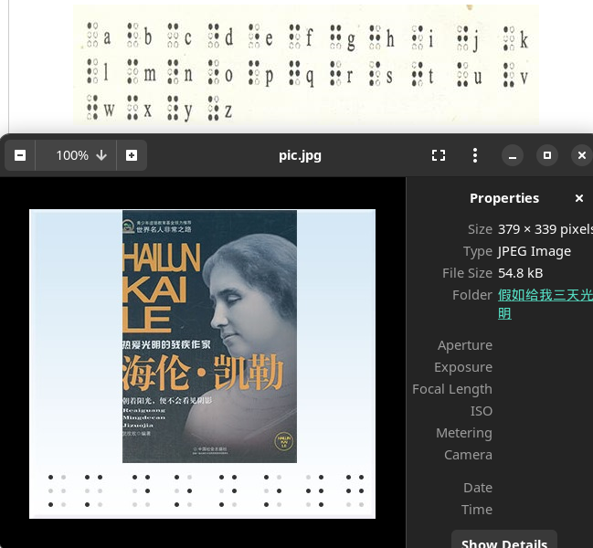
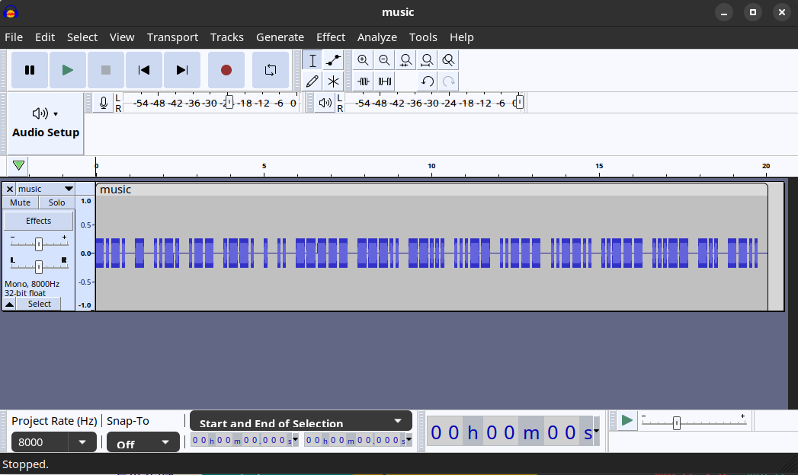
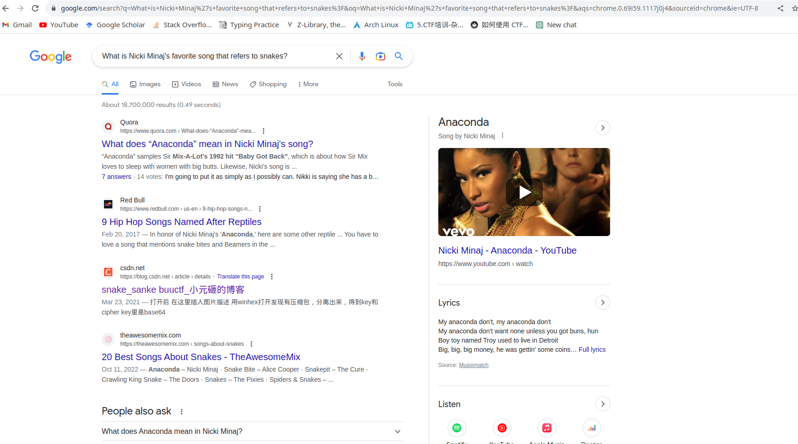
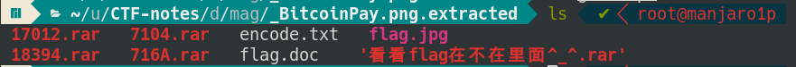
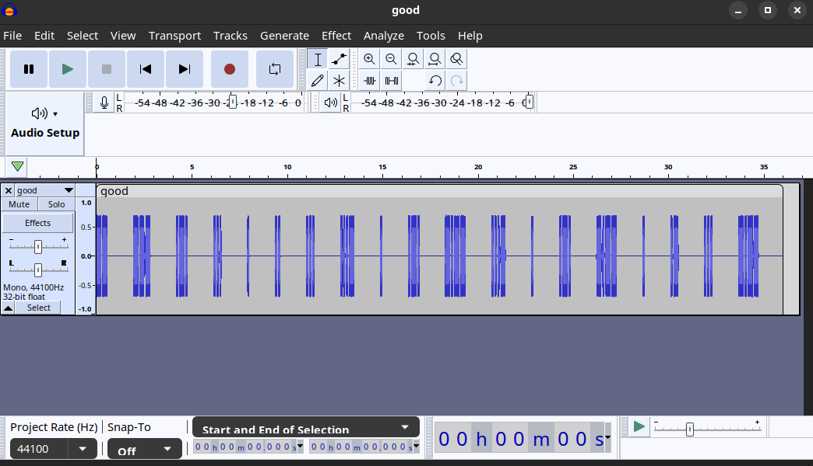

Linux environment
# 1. 金三胖(buuoj.cn)
Download the zip file and unzip it, you'll find a gif in it.

use **convert** command to transform it to png(target: split the gif frame by frame)
```bash
# convert aaa.gif flag.png
```
And then you'll find seventy or more flag-numbers.png, in which there are three photos with information about flag.(flag{he11ohongke})

# 2. 二维码(buuoj.cn)
There is a QR-png in the zip file

Use **binwalk** command you can see a zip file hidden in the png file. And the use binwalk to extract the file like below
> binwalk -e QR_code.png --run-as=root
> you may be can run it without "--run-as=root"

In the .extracted file you can see a empty 4numbers.txt and an encrypted zip file.You can easily guess that the password is a four-digit number.

Then use **fcrackzip** to crack the password, maybe others as you like
```bash
# fcrackzip -b -c '1' -l 4 -u 1D7.zip
```
With respect to the usage of fcrackzip, please man it yourself.(flag{vjpw_wnoei})

# 3. 你竟然赶我走(buuoj.cn)
Download and unzip the file and there is jpg file in it.
Use the **hexedit** to check the hex and ascii code of jpg. Search the "flag" in ascii you will find the flag.(flag{stego_is_s0_bor1ing})

# 4. 大白(buuoj.cn)

The picture can not open at first which remind you that a error happened in CRC code. Use tweakpng or stegsolve to show the right CRC. Here I used the stegsolve because it gives the width and height at same time. 

> stegsolve and analyse dabai.png


You can see the CRC right now is "6d7c7135" and calculated CRC is "8e14dfcf".
Then use hexedit to modify the CRC area and Ctr-X to save. After that the picture can be successfully open, but it is only half.

Double the height of png from 0100 to 0200 with hexedit, and calculate the new CRC with tweakpng(this time stegsolve can't work). Modify the CRC to new value(bffcc552) and then you can find the flag.(flag{He1l0_d4_ba1})**Notice the digits and characters**


# 5. N种解决方法

There is an exe file in the zip file. Use **file** command to KEY.exe, it show that "ASCII text, with very long lines...". Open it you can see "data:image/jpg;base64" in the beginning.

That hint us to transform the file to jpg file with base64 encryption. There is a lot of website you can find with google. Then you'll get a QR code.


Use **zbarimg** or QR-scanner in weixin as you like to scan it.(flag{dca57f966e4e31fd5b15417da63269})

# 6. 乌镇峰会种图
Just like 3.

# 7. 基础破解(buuoj.cn)

The tip in the questions where you download the zip file implied that the password for the rar file is a four-digit.

Use **rarcrack** to crack the password(don't forget to modify the pattern to digits and set beginning with 0000 in xml file).


Unrar the rar file and cat the flag.txt, you can see a base64 string, decode it in any website and then take the flag.(flag{70354300a5100ba78068805661b93a5c})

# 8. LSB(buuoj.cn)
To use binwalk you can find a zlib file in the picture, it misleads me at first.
But later I notice that the topic is LSB! So I use stegsolve to extract the png like this. Here save the file as binary.
As for why I choose the rgb, that's just my guess...


After that you can see the binary file is a QR code. Scan it you can get the flag.(flag{1sb_i4_s0_Ea4y})

# 9. 镜子里面的世界
It's a LSB questions. Just do as 8.

Save as binary and **strings** the data file, you can see the security words.
(flag{st3g0_saurus_wr3cks})

# 10. 另一个世界

It seems that everything is normal about the monster.jpg.
After trying all tools you can use, you may find a binary string in the end with the **strings** command.
Transform the binary string to ascii, you can see the flag.(flag{koekj3s})

# 11. 神秘龙卷风
There is a rar file which you can easily encrypt using rarcrack.
Then you'll get a strange txt file full of '+','.','>'. Guess that the '.>' is just separator and the number of '+' represent for something. We transform the number of '+' to ascii code in every region separating by '.>' with python.

** In fact, it's a program language called brainfuck**
```python
 txt = ''
 with open('./mystery.txt','r') as file:
     count = 0
     ch = file.read(1)
     while ch:
         if ch == '+':
             count += 1
 
         elif ch == '.':
             txt += chr(count)
             count = 0
             # read the '>'
             file.read(1)
 
         ch = file.read(1)
 
 print(txt)
```
Run the code we get the flag.(flag{e4bbef8bdf9743f8bf5b727a9f6332a8})

# 12. 荷兰宽带数据泄漏

看到题目是关于宽带的,再看下载的文件中为conf.bin
google发现这是一个路由器配置文件,可以用**routepassview**进行查看


The flag is username's value, but I dont's know why.

# 13. 假如给我三天光明
In the file you can see a .jpg and a .zip(in fact a .rar, you can use file cmd to easily show)

Modify the suffix '.zip' to '.rar', then you need a password.
Open the picture you see <<Halln KaiLe>>, a story about blind, in the bottom of which is some strange symbols. RIGHT! That's braille!(盲文)

Search the table you can find the password is **kmdonowg**
There is an audio in the rar. Use **audacity** to open it, the waveform is just a Morse code.

Google youself to find the flag corresponding to the morse code.

# 14. 九连环

Use binwalk to check the jpg file and find a zip file.
```
# binwalk -e 123456cry.jpg
```
There is a dir and zip file in the .jpg.extracted 
Binwalk the 4C68.zip you can see the file in it is just 'asd', binwalk has help us unzip the file in the first step.(In fact it's a pseudo encryption伪加密). So we don't need to care it anymore.

cd acd, the password of qwe.zip must hide in the jpg.
But after trying every tools, I can find nothing. Then I look at other's wp and find a tool called **steghide**.
Use it like this:
```
# steghide extract -sf stegfile
```
Then we get the password for the zip. Unzip the file we get the flag.

# 15. Snake(https://buuoj.cn/challenges#snake)

As a routine, unzip the file and binwalk the jpg.
There is a 'cipher' and 'key' in the zip.

Show the key there is a base64 string, decode it you can see the words "What is Nicki Minaj's favorite song that refers to snakes?"

Google you get the key "anaconda"(Guess it)


The next step is what I searched online. 
Use this web to decode the cipher file.[serpent](http://serpent.online-domain-tools.com/)
(flag{who_knew_serpent_cipher_existed})

# 16. [GXYCTF2019]佛系青年

伪加密+[与佛论禅](https://www.keyfc.net/bbs/tools/tudoucode.aspx)
> flag{w0_fo_ci_Be1}

# 17. 菜刀666(https://buuoj.cn/challenges#%E8%8F%9C%E5%88%80666)

The subject is much difficult than before.

See the Wp here: [666](https://blog.csdn.net/qq1124794084/article/details/79125175/)

# 18. 神奇的二维码 

You get a Bitcoin picture for fun. Use binwalk you find some rar file in it.


There are four rar file and some other file in the directory. You can find that 17012.rar, 7104.rar, 716A.rar have nothing new and 18394.rar need a password.

The flag.jpg is just a elicit, cat the encode.txt you find a base64 string, decode it on web and password is **asdfghjkl1234567890**

Then use the password before to unrar the '看看flag...'. But what depressing us is content is the flag.jpg

Finally we are going to see the flag.doc and 18394.rar. Use [python script](../CTFPython/MultiBase64.py) to decode the multi-base64 string(flag.doc).
We get the password **comEON_YOuAreSOSoS0great**, use which to unrar the 18394.rar and there is a good.wav.

Open the wav with **audacity**, the wave shape is obviously a morse code. Docode it in google we get the flag.(flag{morseisveryveryeasy})


# 19. 
