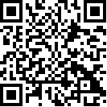

Linux environment
# 1. 金三胖(buuoj.cn)
Download the zip file and unzip it, you'll find a gif in it.

use **convert** command to transform it to png(target: split the gif frame by frame)
```bash
# convert aaa.gif flag.png
```
And then you'll find seventy or more flag-numbers.png, in which there are three photos with information about flag.(flag{he11ohongke})

# 2. 二维码(buuoj.cn)
There is a QR-png in the zip file

Use **binwalk** command you can see a zip file hidden in the png file. And the use binwalk to extract the file like below
> binwalk -e QR_code.png --run-as=root
> you may be can run it without "--run-as=root"

In the .extracted file you can see a empty 4numbers.txt and an encrypted zip file.You can easily guess that the password is a four-digit number.

Then use **fcrackzip** to crack the password, maybe others as you like
```bash
# fcrackzip -b -c '1' -l 4 -u 1D7.zip
```
With respect to the usage of fcrackzip, please man it yourself.(flag{vjpw_wnoei})

# 3. 你竟然赶我走(buuoj.cn)
Download and unzip the file and there is jpg file in it.
Use the **hexedit** to check the hex and ascii code of jpg. Search the "flag" in ascii you will find the flag.(flag{stego_is_s0_bor1ing})

# 4. 大白(buuoj.cn)

The picture can not open at first which remind you that a error happened in CRC code. Use tweakpng or stegsolve to show the right CRC. Here I used the stegsolve because it gives the width and height at same time. 

> stegsolve and analyse dabai.png


You can see the CRC right now is "6d7c7135" and calculated CRC is "8e14dfcf".
Then use hexedit to modify the CRC area and Ctr-X to save. After that the picture can be successfully open, but it is only half.

Double the height of png from 0100 to 0200 with hexedit, and calculate the new CRC with tweakpng(this time stegsolve can't work). Modify the CRC to new value(bffcc552) and then you can find the flag.(flag{He1l0_d4_ba1})**Notice the digits and characters**


# 5. N种解决方法

There is an exe file in the zip file. Use **file** command to KEY.exe, it show that "ASCII text, with very long lines...". Open it you can see "data:image/jpg;base64" in the beginning.

That hint us to transform the file to jpg file with base64 encryption. There is a lot of website you can find with google. Then you'll get a QR code.


Use **zbarimg** or QR-scanner in weixin as you to scan it.(flag{dca57f966e4e31fd5b15417da63269})

# 6. 乌镇峰会种图
Just like 3.

# 7. 基础破解(buuoj.cn)

The tip in the questions where you download the zip file implied that the password for the rar file is a four-digit.

Use **rarcrack** to crack the password(don't forget to modify the pattern to digits and set beginning with 0000 in xml file).


Unrar the rar file and cat the flag.txt, you can see a base64 string, decode it in any website and then take the flag.(flag{70354300a5100ba78068805661b93a5c})

# 8. LSB(buuoj.cn)
To use binwalk you can find a zlib file in the picture, it misleads me at first.
But later I notice that the topic is LSB! So I use stegsolve to extract the png like this. Here save the file as binary.
As for why I choose the rgb, that's just my guess...


After that you can see the binary file is a QR code. Scan it you can get the flag.(flag{1sb_i4_s0_Ea4y})

# 9. 镜子里面的世界
It's a LSB questions. Just do as 8.

Save as binary and **strings** the data file, you can see the security words.
(flag{st3g0_saurus_wr3cks})

# 10. 

